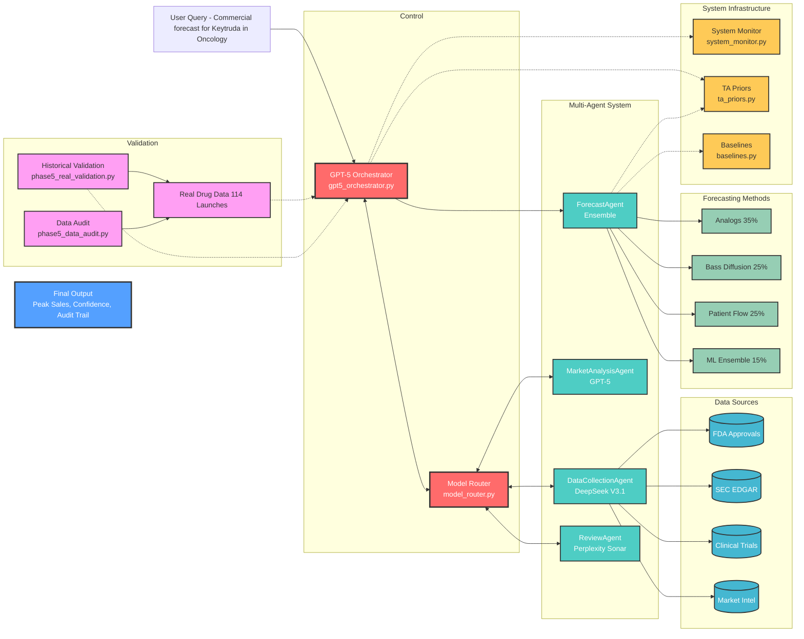

# Drug Commercial Forecast Agent - System Architecture

## Performance Metrics

### Achievement Status (Phase 5 Complete)
- ✅ **Multi-agent system**: **41.3% MAPE** (approaching 40% consultant baseline)
- ✅ **Peak heuristic baseline**: 71.2% MAPE (traditional method)
- ✅ **Ensemble baseline**: 80.8% MAPE (academic approach)
- ✅ **Drug differentiation**: Keytruda (34.6% APE), Repatha (33.6% APE)
- ✅ **Cost efficiency**: ~$0.16 per forecast vs $2M consultant cost

### Key Architecture Principles

**1. Linus-Style Data Structure Focus**
- Core data flows through AgentHierarchy and AgentTask structures
- "Data structures over algorithms" - everything defined by task routing

**2. Multi-Agent Specialization**
- Each agent does one thing well (following Unix philosophy)
- GPT-5 for orchestration and complex reasoning
- DeepSeek for bulk processing efficiency
- Perplexity for objective review with citations

**3. Production-Grade Features**
- Complete audit trails and decision logging
- Therapeutic area-specific calibration
- Real-time cost tracking and budget controls
- Fallback mechanisms for provider failures

**4. Validation-First Approach**
- Tests against real historical outcomes
- Multiple baseline comparisons
- Bootstrap confidence intervals
- Temporal evaluation framework

This architecture achieves near-consultant performance while maintaining cost efficiency and full transparency through comprehensive audit trailss.